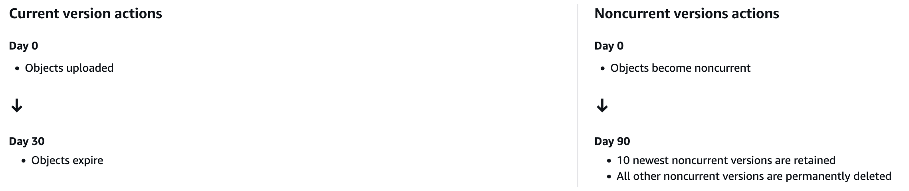

### A Note to Contributors

Please make an effort to follow these guidelines and conventions to help us keep our code and commit history clear and organized. If you have ideas for further improvements, or better conventions, we'd like to hear them :)

Thank you and happy coding!

— Atlas ❤️

# General Guidelines

[Skip to documentation.](#documentation)

Please write clear and concise code. Use [Prettier](https://prettier.io/docs/en/) for formatting. Ensure that files are well-commented when necessary.

### Responsiveness

REM is 16px. Do not use any absolute length units. Justification must be provided if you break this rule. Borders excepted.

### Accessibility

We make an attempt to follow [WCAG 2.1 AA standards](https://www.w3.org/TR/WCAG21/).

## Conventional Commit Guidelines

This repository follows modified a [conventional commit](https://www.conventionalcommits.org) guide to keep our commit history clear and structured. Here are the commit types to use:

### Commit Types

| Type       | Description                                                                              | Example                                                       |
| ---------- | ---------------------------------------------------------------------------------------- | ------------------------------------------------------------- |
| `build`    | Changes that affect the build system or dependencies.                                    | `build: update to latest mindfulness package`                 |
| `ci`       | Changes to continuous integration setup, like configuration files.                       | `ci: add deployment workflow for GitHub Actions`              |
| `cms`      | Changes to Payload CMS configuration and the like.                                       | `cms: add new pages collection`                               |
| `merge`    | Represents any `git merge`.                                                              | `merge: branch 'master' into about-page`                      |
| `content`  | Adding, updating, or removing website content (text, images, etc.).                      | `content: update About Us page`                               |
| `feat`     | A new feature or functionality added to the website.                                     | `feat: add search bar to the navigation`                      |
| `fix`      | A bug fix, including broken links, layout issues, or code bugs.                          | `fix: resolve mobile menu not opening on small screens`       |
| `resp`     | Changes to improve responsive design.                                                    | `resp: decrease side margins for smaller devices`             |
| `a11y`     | Accessibility improvements to enhance website usability.                                 | `a11y: add alt text to all homepage images`                   |
| `ui`       | Visual changes to the site’s appearance (e.g., colors, fonts, spacing adjustments).      | `ui: change button color to match theme`                      |
| `perf`     | Changes made to improve website performance (e.g., optimizing images or code).           | `perf: lazy-load images on about us page`                     |
| `refactor` | Code restructuring or cleaning that doesn’t change any functionality.                    | `refactor: reorganize header component files`                 |
| `seo`      | Changes to improve search engine optimization.                                           | `seo: update meta descriptions for mental wellness page`      |
| `legal`    | Updates to legal documents, like privacy policies or terms of service.                   | `legal: update privacy policy to include new data use clause` |
| `docs`     | Documentation changes, such as README updates, guidelines, or other informational files. | `docs: add commit guidelines for contributors`                |
| `other`    | If you must...                                                                           | `other: go on a relaxing stroll in outremont`                 |

### Example Usage

- **Adding a New Page**: `feat: add a contact page with form`
- **Changing Colors on Buttons for Consistency**: `ui: update primary button color across site`
- **Fixing Broken Link**: `fix: correct link in footer to redirect to new policy page`
- **Improving Page Load Speed**: `perf: compress splash images to improve load time`
- **Making Images More Accessible**: `a11y: add captions to staff photos`
- **Updating Privacy Policy**: `legal: update privacy policy to reflect data protection laws`

### General Rules

- **Atomic Commits**: Each commit should represent a single, specific change, to the best of your ability.
- **Message Clarity**: Ensure commit messages clearly state what the change is.
- **Message Length**: Try to limit commit messages to under 50 characters if possible, but do not sacrifice clarity to meet said limit. (some of the examples above use more than 50 characters!)
- **Descriptions**: Descriptions are...a free for all...for right now. Ensure clarity and concision nevertheless.
- **Scope**: Use lowercase, concise scopes if you want to specify a particular section (e.g., `feat(nav): add dropdown menu`).

### Husky

These commit guidelines are remotely enforced and deployment will be blocked if conventions are not adhered to.

To prevent "bad" commit messages from reaching the remote server in the first place, we use [Husky](https://typicode.github.io/husky/) to run [commitlint](https://commitlint.js.org/guides/ci-setup.html) on every commit attempt. Husky is already installed locally as a dev dependency when you clone this repo.

You do not need to take any action here, but be aware of what is going on here and do not modify anything in [/.husky/](/.husky/).

If you would like to add additional commit types, you may edit [/.commitlintrc.ts](/.commitlintrc.ts), and of course remember to update the documentation here. You should however, not have to do this. Take caution.

# Documentation

## Stack

- Payload CMS
- Next.js
- Tailwind CSS
- Neon Serverless Postgres

Not all dependencies are listed above. Run `npm list` for all dependencies.

## Payload CMS

This project runs on [Payload CMS](https://payloadcms.com/docs/getting-started/what-is-payload).

## Styling

### Colors

[Tailwind CSS](https://tailwindcss.com/docs) is used for styling. See the [config](./tailwind.config.js) for colors defined in [src/global.css](src/global.css). Attempt to always use colors defined in these files.

### Payload CMS' Lexical Rich Text

See Tailwind CSS' [Typography plugin](https://github.com/tailwindlabs/tailwindcss-typography) for a set of prose classes to style Rich Text from Payload.

## Pages

## SEO

### Pages

SEO titles and meta descriptions for each page are pulled from Payload's `Pages` collection.

Metadata is exported as such in each page's code:

```tsx
import { Metadata } from "next";
import { getPageFromCMS } from "@/lib/getPageFromCMS";

export async function generateMetadata(): Promise<Metadata> {
    const page = await getPageFromCMS("page-slug-here");
    return {
        ...(page && {
            title: page.title,
            description: page.seoDescription,
        }),
    };
}
```

#### Clubs & Resources

SEO title and description are respectively pulled from the `title` and `description` fields of Payload's `Clubs` or `Resources` collection.

## Integrations

### Mailchimp

API keys are secured server-side with Next.js' server components. See [Mailchimp's stance on API key security](https://mailchimp.com/help/about-api-keys/#api+key+security). See Mailchimp's [documentation](https://mailchimp.com/developer/marketing/api/) for more.

#### To add a subscriber

Use `addListMember(email_address: string)` from [addMailchimpSubscriber.ts](src/lib/addMailchimpSubscriber.ts).

#### Removing subscribers

Please ARCHIVE subscribers. Do not permanently delete a user unless they have requested their data deleted. If a user is permanently deleted; they will not be able to resubcribe with the same email using our newsletter form.

See this [StackOverflow explanation](https://stackoverflow.com/a/52376496/) and Mailchimp's [official documentation](https://mailchimp.com/help/delete-contacts/#Archive_vs._Remove).

## Error Handling / Common Errors

### Dynamic APIs are Asynchronous

Read [Dynamic APIs are Asynchronous](https://nextjs.org/docs/messages/sync-dynamic-apis) and run

```sh
npx @next/codemod@canary next-async-request-api .
```

Then commit

```sh
git commit -m "fix: sync dynamic APIs"
```

### Type errors in src/app/(payload)/

Do not edit any files in the `(payload)` folder, with the exception of `custom.scss` and `layout.tsx`. To address any type issues, consider upgrading Payload to the latest version. **CAUTION:** Verify that the project is already on the latest version of Payload before proceeding. Upgrading without this confirmation could introduce unexpected issues, so ensure the decision to upgrade is made carefully. If upgrading is not feasible, explore alternative solutions.

To update Payload, use the following command:

```sh
npx create-payload-app@latest
```

Then commit:

```sh
git commit -m "cms: fix ts errors in (payload)"
```

Ensure you add a message if an upgrade was actually made (i.e. the version changed).

## PostgreSQL Backups with AWS S3

Originally set up with [these instructions](https://joshstrange.com/2024/04/26/nightly-postgres-backups-via-github-actions/) on Friday, January 17, 2025.

### Backups

Backups are made nightly at 03:42 EST.

### Lifecycle

Current versions of objects will be [expired](https://docs.aws.amazon.com/AmazonS3/latest/userguide/lifecycle-expire-general-considerations.html) 30 days after object creation. Noncurrent versions of objects will be [permanently deleted](https://docs.aws.amazon.com/AmazonS3/latest/userguide/intro-lifecycle-rules.html) after 90 days; 10 of the newest noncurrent versions are retained.



# Archived Documentation

For documentation which may no longer be relevant.

### Bulk Importing to Payload

To (re)import **club** or **resource tags**, modify the `json` files located in [scripts/bulkUpload/tagData/](scripts/bulkUpload/tagData/), then run:

```sh
payload run scripts/bulkUpload/bulkUploadTags.ts <club|resource>
```

To (re)import **clubs** or **resources**, modify the `json` files located in [scripts/bulkUpload/entityData/](scripts/bulkUpload/entityData/), then run:

```sh
payload run scripts/bulkUpload/bulkUploadClubs.ts
# or
payload run scripts/bulkUpload/bulkUploadResources.ts
```
